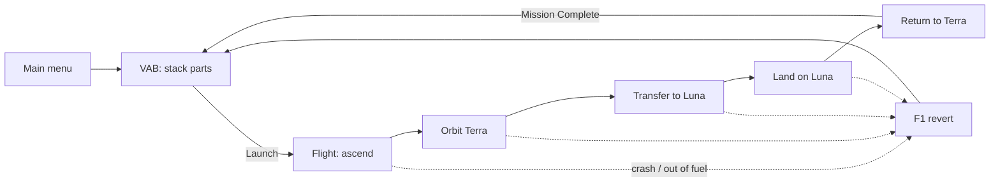
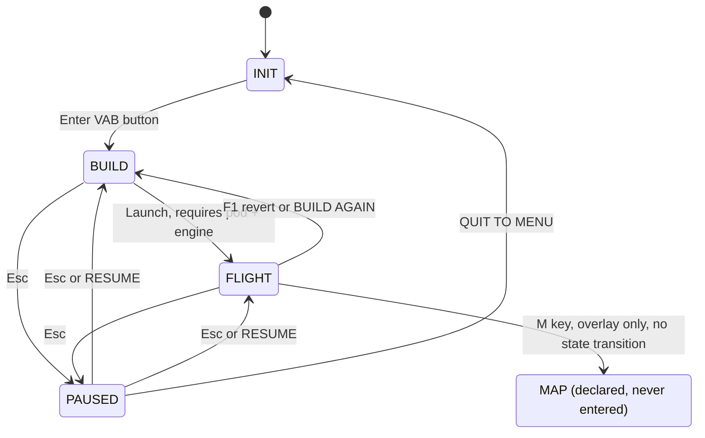
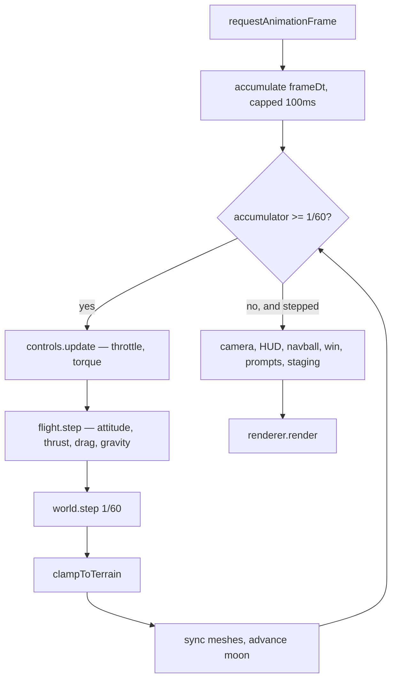

# Project Orbital Frogs — Game Design Document

```yaml
document:   Game Design Document (GDD)
project:    Project Orbital Frogs
repository: FactionRed/Project-Orbital-Frogs
game_version: 0.4.0
doc_version:  0.4.0
doc_status:   as-built specification + stubbed vision
last_verified_against: 2023cd7
```

> **Related documents.** `docs/superpowers/specs/2026-07-18-gui-ux-overhaul-design.md` is the visual design spec for the interface; `docs/superpowers/plans/2026-07-18-gui-ux-overhaul.md` is the implementation plan it was built from. This GDD covers what the game *is*; those cover what the interface *looks like*.

---

## How to use this document

**This document has two kinds of content, and they are labelled.**

| Marker | Meaning |
| --- | --- |
| ✅ **As-built** | Describes code that exists and runs today. Every number was read from source or computed from it. A source reference (`src/…`) is given. If the code and this doc disagree, **the code is right and this doc is stale** — fix the doc. |
| 🔭 **Vision** | Intent, not implementation. Nothing here exists yet. Do not treat as a spec to code against without confirming with the project owner. |
| ❓ **Open question** | A decision nobody has made. Answering these is the most valuable edit you can make. |

**If you are a human:** the [Elevator pitch](#1-elevator-pitch) and [Design pillars](#2-design-pillars) tell you what this game is. [Core loop](#3-core-loop) tells you how it plays. Everything after that is reference.

**If you are an LLM agent:** read [§11 Agent interface](#11-agent-interface) before touching anything. Key rules:

1. **Numbers in this doc are derived, not authoritative.** The authority is `src/physics/constants.ts`, `src/entities/parts-catalog.ts`, and the constants at the top of each module. This doc tells you *where* each number lives so you can change it in one place.
2. **The tuning is a connected system.** Changing one constant silently invalidates several others — see [§12 Tuning reference](#12-tuning-reference) for the dependency chains before editing.
3. **Preserve the invariants** in [§11.3](#113-invariants). They encode bugs that were already fixed once.
4. When you change behaviour, **update the matching section here in the same commit** and bump `last_verified_against`.

---

## Table of contents

1. [Elevator pitch](#1-elevator-pitch)
2. [Design pillars](#2-design-pillars)
3. [Core loop](#3-core-loop)
4. [Game states and screens](#4-game-states-and-screens)
5. [The VAB — ship construction](#5-the-vab--ship-construction)
6. [Flight model](#6-flight-model)
7. [The world — Terra and Luna](#7-the-world--terra-and-luna)
8. [Player interface](#8-player-interface)
9. [Mission milestones and failure](#9-mission-milestones-and-failure)
10. [Technical architecture](#10-technical-architecture)
11. [Agent interface](#11-agent-interface)
12. [Tuning reference](#12-tuning-reference)
13. [Known gaps and inconsistencies](#13-known-gaps-and-inconsistencies)
14. [Roadmap and open questions](#14-roadmap-and-open-questions)
15. [Glossary](#15-glossary)

---

## 1. Elevator pitch

✅ **As-built**

> Build a rocket out of a handful of parts, fly it off a procedurally generated planet, orbit, transfer to a moon, land, and come home. The whole space program fits in a browser tab and takes about ten minutes to fail at.

Project Orbital Frogs is a miniature Kerbal Space Program. It keeps the parts that make KSP's fantasy work — real orbital mechanics, a build-it-yourself rocket, a flight that fails for reasons you can diagnose — and throws out the tech tree, the economy, the campaign, and the part count.

| Attribute | Value |
| --- | --- |
| Genre | Physics sandbox / space flight sim |
| Perspective | 3D third-person, orbital camera |
| Platform | Browser (Vite dev server) and Windows desktop (Electron, portable `.exe`) |
| Session length | 2–10 minutes per launch attempt |
| Content scale | 7 parts, 2 celestial bodies, 4 mission milestones |
| Rendering | Procedural geometry and shaders; three bundled webfonts |
| Source size | ~6,000 lines of TypeScript + ~800 lines of CSS |

**Why it exists in this shape.** All geometry and shading is generated in code (`src/rendering/`), so the game has no art pipeline. The only binary assets in the repository are three `.woff2` webfonts under `public/fonts/`, added by the interface overhaul. The whole thing is still a single static bundle — see [§2](#2-design-pillars).

---

## 2. Design pillars

✅ **As-built** — these are inferred from consistent decisions across the codebase, not from a prior written statement of intent. See [§14](#14-roadmap-and-open-questions) if you want to revise them.

### 2.1 Real physics, forgiving numbers

The simulation is honest: inverse-square gravity, conservation of momentum, Tsiolkovsky mass ratios, exponential atmospheric density. But the *constants* are tuned for a game, not for Earth. Surface gravity is a round 10 m/s², orbital velocity is 173 m/s, and a good rocket reaches orbit in under a minute.

The player learns real orbital intuition — burn prograde to raise the far side, a gravity turn beats going straight up — on numbers small enough to hold in their head.

> `src/physics/constants.ts` opens with this exact rationale: *"NOT real SI — abstract 'KSP units,' calibrated so surface gravity is ~10 m/s² (Earth-like, intuitive)."*

### 2.2 Failure is diagnosable

When a launch fails, the player should be able to say *why*. Every failure mode has a visible instrument attached to it:

| Failure | The instrument that warned you |
| --- | --- |
| Ran out of fuel | `FUEL` readout, staging panel |
| Went too fast too low | `Q` readout turns red |
| Never reached orbit | `Ap/Pe` readout shows periapsis inside the planet |
| Came down too hard | Navball + velocity readout |
| Tumbled | Navball, SAS indicator |

### 2.3 Small enough to hold in your head

Seven parts. Two bodies. Four milestones. A player can enumerate the entire content of the game after one session, which makes mastery — rather than discovery — the thing that keeps them playing.

### 2.4 Procedural everything

No textures, no mesh files, no audio. Parts are voxel models built in code (`src/rendering/part-models.ts`, see [§5.6](#56-part-models-and-art-direction)); planets are noise-displaced spheres with shader-based biomes and a day/night terminator (`src/rendering/procedural-planet.ts`). The asset loader (`src/assets.ts`) exists but currently has nothing to load.

**This pillar has one exception.** The interface overhaul added three webfonts (`public/fonts/` — VT323 and IBM Plex Mono) to carry the vintage-terminal look. They are the first non-procedural assets in the project.

❓ **Open question:** is the pillar "no external assets" or "no external *art* assets"? The answer decides whether audio is admissible later. See [§14.3](#143-candidate-features).

### 2.5 The build is the difficulty curve

There is no tutorial, no tech tree, and no unlock gating. The only thing standing between the player and Luna is whether their rocket has enough delta-v — which is a consequence of which engines they chose and where they put the decoupler. Difficulty is authored entirely through the [tuning](#12-tuning-reference).

---

## 3. Core loop

✅ **As-built**



The loop is **build → fly → fail → diagnose → rebuild**. The reward for a successful flight is the same as the reward for a failed one: you go back to the VAB. What changes is what you know.

### 3.1 The intended first hour

| Attempt | What the player learns |
| --- | --- |
| 1 | Space ignites the engine. Straight up doesn't work — you fall back. |
| 2 | A gravity turn (pitch east after ~300 m) gets you sideways fast enough to orbit. |
| 3 | One stage is not enough for the Moon. Struts split stages. |
| 4 | Burning prograde at the right moment raises apoapsis to Luna's orbit. |
| 5+ | Landing softly is a separate skill from getting there. |

❓ **Open question:** nothing in the game currently teaches step 2 except a one-line prompt (`src/ui/flight-prompts.ts`) and the `Q` readout. Is discovery-through-failure the intent, or is this a gap?

### 3.2 Progression and persistence

✅ **As-built:** there is **none**. Every session starts from an empty VAB. Ship designs are not saved, milestones are not recorded between launches, and the only persisted state in the entire game is whether the help overlay is visible (`localStorage.hintsVisible`, `src/main.ts`).

🔭 **Vision:** see [§14.3](#143-candidate-features).

---

## 4. Game states and screens

✅ **As-built** — `src/core/state-machine.ts`



| State | What renders | Camera |
| --- | --- | --- |
| `INIT` | 3D crash-site scene on Luna's equator + title menu | `MenuScene` — slow auto-orbit |
| `BUILD` | VAB grid, placed parts, part palette, hints | `VabCamera` — right-drag orbit, wheel zoom |
| `FLIGHT` | Planet, moon, ship, full flight HUD | `FlightCamera` — position-follow, world-up |
| `PAUSED` | Settings overlay over the frozen screen beneath | *(frozen)* |
| `MAP` | *(declared in the type but never transitioned to)* | Orbit map borrows the VAB camera object |

**Transitions are validated.** `StateMachine` holds an `ALLOWED` table and **throws** on any path not in it, so a wrong transition surfaces as a loud failure rather than a screen silently stuck in the wrong mode. `pausedFrom` remembers which screen opened the pause overlay so RESUME returns to it.

**Pause really freezes.** While in `PAUSED` the physics step is skipped, and `M` is ignored so the map can't fight a frozen simulation.

**Esc is layered** (`src/main.ts`) — it backs out of the innermost thing first:

```
INIT      → close settings overlay if open, else nothing
PAUSED    → resume
BUILD     → cancel the placement ghost if one is held, else pause
FLIGHT    → close the orbit map if open, else pause
```

**The map is still an overlay.** `orbitMap.toggle()` shows it; `fsm.transition('MAP')` is never called from anywhere. The `MAP` member of `GameState` remains dead despite now appearing in the `ALLOWED` table. See [§13](#13-known-gaps-and-inconsistencies).

---

## 5. The VAB — ship construction

✅ **As-built** — `src/building/vab-controller.ts`, `src/entities/parts-catalog.ts`

The Vehicle Assembly Building is where the player stacks parts. It is a free-placement 3D editor with node snapping, not a grid.

### 5.1 Parts catalog

All five parts, complete. `size` is **half-extents** in metres; a tank is therefore 3 m wide and 5 m tall.

| Part | Kind | Dry mass (t) | Fuel | Thrust sea / vac (kN) | Exhaust vel. (m/s) | Attach nodes |
| --- | --- | --- | --- | --- | --- | --- |
| Command Pod | `pod` | 0.80 | — | — | — | bottom only |
| Fuel Tank | `tank` | 1.20 | 120 | — | — | top + bottom |
| Booster Engine | `engine` | 1.80 | — | 240 / 265 | 290 / 320 | top only |
| Vacuum Engine | `engine-vac` | 1.20 | — | 55 / 130 | 190 / 450 | top only |
| Stack Decoupler | `decoupler` | 0.20 | — | — | — | top + bottom |
| Winglet | `winglet` | 0.10 | — | — | — | **none** (surface-attach) |
| Strut | `strut` | 0.05 | — | — | — | top + bottom |

Fuel has mass: `FUEL_DENSITY = 0.02 t` per unit, so a full tank weighs **2.4 t of fuel + 1.2 t dry**.

**The two engines are deliberately bad at each other's job.** The booster has the thrust to leave the pad and mediocre efficiency; the vacuum engine is far more efficient but cannot lift its own rocket through air. Where each one goes matters more than how many you bolt on — see [§5.5](#55-reference-designs).

**The Winglet is currently decorative.** It has no aerodynamic effect anywhere in the simulation — drag is applied uniformly per rigid body with no reference to part geometry (`src/flight/flight-controller.ts`, drag loop). Its description says "Aerodynamic fin for stability"; that is aspirational. See [§13](#13-known-gaps-and-inconsistencies).

**The Stack Decoupler splits stages.** Struts used to do this job, which meant the part labelled "structural connector" silently decided the staging and there was no way to brace a rocket without also cutting it in half. Struts are now purely structural.

### 5.2 Attachment model

Modelled on KSP's stack nodes (`src/entities/part.ts`). Each node is a local-space position plus an outward normal. Two nodes connect when their normals oppose.

Snapping resolves in strict priority order (`VabController.onPointerMove`):

1. **Node snap** — the ghost has nodes, and an unoccupied node on a placed part faces the opposite way within `NODE_SNAP_RANGE = 2.5 m` of the pointer. The ghost is rotated to align and positioned so the nodes coincide. Ghost tints **green**.
2. **Surface attach** — raycast against placed parts; the ghost is pushed out along the hit normal by its own half-extent. Rotation is left to the player. Used by winglets and anything with no free node. Ghost tints **green**.
3. **Ground plane** — falls back to Y=0. This is how the first part gets placed. Ghost tints **blue**.

Unoccupied nodes render as small spheres while dragging: **green** = compatible with the held part, **grey** = incompatible.

### 5.3 Launch validity

`launchReadiness()` (`src/entities/ship.ts`) requires exactly two things:

- at least one `pod`
- at least one `engine`

That's it. A pod and an engine with no fuel tank is a legal, launchable, completely useless rocket. Structural soundness, TWR, and delta-v are never checked — the player finds out on the pad.

When the design isn't ready, `launchBlockerText()` returns the reason (`NEEDS COMMAND POD + ENGINE`) and the VAB shows it beside the disabled Launch control — *"a disabled control that doesn't say what it wants is a dead end for the player."*

The **root part** is the first `pod` placed. Deleting a part re-parents its children to its own parent rather than orphaning them.

### 5.4 Staging derivation

Stages are **derived from the part tree**, never authored (`src/flight/stage-manager.ts`):

1. From each engine, walk up the `attachParentUid` chain, collecting tanks.
2. Stop at the first `decoupler` — that is this stage's separation point.
3. Engines sharing a decoupler merge into one stage.
4. Order by decoupler depth, deepest first. Engines with no decoupler fire last.

So **a decoupler between two tank/engine groups creates a stage boundary**, and the group *below* it fires first. The part's description says so, but nothing in the VAB shows the resulting stage split while you build.

### 5.5 Reference designs

Computed from the catalog. `TWR` is at liftoff and uses **sea-level** thrust — the number that decides whether the rocket moves at all.

| Design | Δv (m/s) | Liftoff TWR | Outcome |
| --- | --- | --- | --- |
| **Booster below, vacuum above, decoupler between** | **411** | **1.30** | **Reaches orbit** |
| One stage, booster only | 157 | 3.87 | Plenty of thrust, nowhere near the Δv |
| One stage, vacuum only | 252 | 0.98 | Never leaves the pad |
| Vacuum engine on the first stage | — | 0.31 | Never leaves the pad |
| Booster on both stages | 309 | 1.26 | Short — the upper stage wants efficiency |

A stable low orbit costs roughly **350 m/s** once gravity and drag losses are paid, against an ideal Hohmann cost of 224 m/s. Terra's orbital velocity is 173 m/s and escape is 245 m/s.

**No single stage can both carry the Δv and leave the pad.** Bolting more tanks onto the efficient engine does eventually buy enough Δv, but that rocket is far too heavy for the thrust it has. Satisfying both constraints at once requires staging, which is the point.

### 5.6 Part models and art direction

✅ **As-built** — `src/rendering/part-models.ts`, `src/rendering/voxel-model.ts`

Parts are voxel models generated in code, drawn as recognisable launch-vehicle hardware with liberties taken where the grid or readability demands. The references are the ones named in the source: Atlas V and Vulcan for tanks and interstages, RL10 and BE-4 for the engine bell, Mercury and Apollo for the capsule.

| Part | What it is meant to read as |
| --- | --- |
| Command Pod | Crew capsule — ablative heat shield, shoulder flange, tapered pressure vessel, window, short docking ring. The only glass in the catalog. |
| Fuel Tank | Stage barrel — longitudinal stringers, marking bands, a cable conduit down one side, tinted oxidiser and fuel sections split by a common bulkhead. |
| Engine | Bell nozzle — hard flare from a narrow throat, hollow interior, cooling ribs, turbopump and feed lines. |
| Winglet | Swept delta fin — thin plate, darkened leading edge, root bracket. |
| Strut | Interstage truss and decoupler — corner posts, X-bracing in bays, end flanges, a warning band at the separation plane. |

Two rules govern every model:

1. **Build on the part's own grid.** Models are laid out at `RES = 12` voxels per world unit and the finished mesh is scaled **uniformly** to fit inside the collision box. Scaling each axis independently — which is what the code did before — forces every model to fill its box exactly and distorts anything whose natural proportions differ. That is what flattened the winglet into a doorstop.
2. **Silhouette first.** At this resolution the outline carries the read and colour only reinforces it. Detail that doesn't change the outline — stringers, cooling ribs, panel seams — is painted on afterwards with `paintIf` rather than modelled, so it costs no triangles.

**Geometry is cached per catalog part** and shared across every mesh; materials are not, because callers tint individual meshes (the placement ghost, VAB selection highlighting). Without the cache, every placed part, every ghost, and every piece of menu debris would rebuild tens of thousands of voxels.

Shapes are composed by layering: a later shape recolours the voxels it covers, and passing `CARVE` instead of a colour removes them, which is how hollow forms like the nozzle throat are made.

**Previewing a change.** `npm run preview:parts` renders every part and an assembled two-stage rocket to `preview/*.png` in a headless browser, and prints the triangle count per part.

```
pod 7372  tank 22276  engine 5092  winglet 2468  strut 9952 | 47160 tris total
```

This exists because the models are the one area with no meaningful automated check on the *result*. The tests can assert that a part fits its collision box and scales uniformly; they cannot assert that it looks like an engine. Look at the output before and after any model change — the winglet spent a release as a flat sliver because nobody had a reason to view it in isolation, and the pod went through three passes of looking like laboratory glassware before its proportions were right.

The tool needs a Chromium. It checks `$CHROME_PATH`, then Playwright's own download, then `$PLAYWRIGHT_BROWSERS_PATH`, then the usual system locations, and tells you how to get one if it finds nothing. Rendering is via SwiftShader, so it works on a machine with no GPU.

---

## 6. Flight model

✅ **As-built** — `src/flight/flight-controller.ts`

### 6.1 Integration

- Fixed **60 Hz** physics (`FIXED_DT = 1/60`), accumulator-driven in `src/main.ts`.
- Frame delta capped at 100 ms, so a backgrounded tab cannot fast-forward the simulation.
- `world.step(dt)` is called in **simple mode, exactly once per step**. This is load-bearing: cannon-es clears forces at the end of each internal step, so sub-stepping would apply the custom gravity on only the first sub-step and run the rest in a vacuum. Variable sub-step counts also break the symplectic property of the integrator and cause orbital energy drift.

### 6.2 Gravity and spheres of influence

`src/physics/gravity.ts`. **One body attracts at a time** — a patched-conic model, like KSP. `dominantBody()` picks the nearest body whose SOI contains the ship; Terra's SOI is infinite, so it's the fallback.

```
F = μ · m / r²      applied toward the dominant body's centre
μ = G · M,  G = 1
```

Luna's SOI is `a · (m/M)^0.4` = **7,299 m** from Luna's centre.

### 6.3 Thrust and fuel

Each engine carries its own performance, and the model is the physical one: **mass flow is fixed by the vacuum rating and never varies**, while delivered thrust falls as air pressure pushes back on the exhaust. Specific impulse therefore drops at sea level on its own rather than being tuned separately.

```
vac            = vacuumFractionAt(altitude)        // 0 at sea level, 1 in space
thrust         = thrustSea + (thrust − thrustSea) × vac
fuel per second = Σ (engine.thrust × engine.burnRate)     // vacuum rating — constant
exhaust velocity = 1 / (burnRate × FUEL_DENSITY)          // in vacuum
```

| Engine | Thrust sea / vac | Exhaust velocity sea / vac | For |
| --- | --- | --- | --- |
| Booster | 240 / 265 kN | 290 / 320 m/s | Getting off the pad |
| Vacuum | 55 / 130 kN | 190 / 450 m/s | Everything after that |

**Why these numbers and not the old ones.** A stage's burn time is close to its own Δv divided by its acceleration, so propulsion tuning decides whether the player has time to fly. Every engine used to share an exhaust velocity of 100 m/s, which needs a **12.7:1 mass ratio** to produce useful Δv — and that rocket ends its burn pulling **34 g** with the tank empty after **3.4 seconds**. A gravity turn here takes 25–40 seconds. There was no time to steer, so every launch was a cannon shot into the thickest air, and orbit was unreachable rather than merely hard.

Mass ratios are now around 1.5–1.8, a two-stage rocket flies for about **17 seconds** and peaks near **4 g**, and the skill moved to where it belongs: choosing the right engine for each stage and getting the TWR right.

Thrust is applied along the **root body's local +Y**, at its centre of mass — so engines never produce torque, regardless of where they're mounted. Off-axis engine placement is not simulated.

Fuel is a single shared pool across the whole ship (`ship.fuel`), not per-tank. Jettisoning a stage does **not** remove its remaining fuel from the pool.

A stage only produces thrust when **activated** — see [§6.6](#66-staging).

### 6.4 Atmosphere

Terra only. Exponential density, quadratic drag, applied per rigid body at its centre of mass.

```
ρ(h) = 0.05 · e^(−h/500)     for 0 ≤ h < 3000 m     [airDensityAt]
F_drag = 0.1 · ρ · v²        opposing velocity
```

`airDensityAt` and `vacuumFractionAt` in `src/physics/constants.ts` are the single source of truth: drag, the `Q` readout, and engine thrust all read the atmosphere through them, so they cannot drift apart.

| Altitude | Density | Relative |
| --- | --- | --- |
| 0 m | 0.0500 | 100% |
| 1,000 m | 0.0068 | 14% |
| 3,000 m | 0.0001 | 0.2% (cutoff) |

The atmosphere extends to exactly one planet radius. Its purpose is to make **going straight up wrong**: velocity gained low in the atmosphere is taxed quadratically, so the efficient ascent is gentle-then-sideways. The `Q` readout is the player-facing signal.

Drag ignores part geometry, orientation, and cross-section entirely. This is why the winglet does nothing.

### 6.5 Attitude control

Three layers, in priority order (`FlightController.step`):

| Layer | Trigger | Behaviour |
| --- | --- | --- |
| **Hold mode** | Hold panel button | PD controller points the nose at a computed direction. Gains: P=20, D=16, scaled by mass. Overrides SAS. |
| **SAS** | `T`, on by default | Pure damping — counter-torque proportional to angular velocity (gain 5 × mass). Holds current attitude; does not fight steering hard. |
| **Manual** | W/S/A/D/Q/E | Torque of 16 kN·m per tonne, halved in precision mode. Always additive. |

Holding `F` suppresses SAS for manual input without toggling it off.

Hold modes (`HoldMode`), computed relative to the **dominant body**:

| Mode | Direction | Guard |
| --- | --- | --- |
| `prograde` / `retrograde` | ±v̂ | Needs speed > 0.5 m/s |
| `normal` / `antinormal` | ±(r × v)̂ | Undefined if r ∥ v |
| `radialin` / `radialout` | ∓r̂ / ±r̂ | Needs r > 0.001 |

All attitude authority is **mass-scaled**, so a heavy ship is exactly as responsive as a light one. Deliberate: it keeps big rockets from feeling broken, at the cost of realism.

### 6.6 Staging

Two-phase, driven by repeated `Space` presses:

1. **First press** — *activates* the current stage. The engine can now produce thrust when throttled. **Nothing is jettisoned.**
2. **Second press** — jettisons that stage's engines, tanks, and decoupler as a new rigid body, advances the stage index, and leaves the next stage *inactive* (it needs its own activation press).

Phase 1 exists because of a real bug: a single-phase design meant the first `Space` press on the pad — the natural "ignite" input — immediately dropped the engine.

Jettisoned parts get a **2 m/s separation nudge** along the parent's local −Y, become an independent dynamic body, and remain in the world under gravity and collision.

### 6.7 Ground handling

**Spawn.** The ship is placed at Terra's **north pole** (+Y), lowered so its lowest part rests exactly on the surface — no clearance, because a floating spawn drops and tips. Every body is set `STATIC` until the player first throttles up, which eliminates spawn jitter while they read the HUD.

**Terrain collision** is manual and runs *after* `world.step()`, overriding cannon-es. The sphere collider at base radius stops fall-through to the core; this pass then clamps the ship to the *visible* terrain:

- For each body: compare distance-from-centre against `terrainRadiusAt(direction)` — the same noise function that displaces the visual mesh.
- If more than **0.5 m** below the surface, snap the position to the surface and zero the inward velocity component. Tangential velocity is preserved, so the ship can slide.

The 0.5 m tolerance prevents the clamp from interfering with liftoff.

**Impact recording.** The clamp is also the only place an impact speed exists, so it records one just before zeroing the velocity:

| Field | Meaning |
| --- | --- |
| `peakImpactSpeed` | Hardest terrain contact this flight, as inward radial speed (m/s). `-1` until first contact. |
| `peakImpactBody` | `'planet'`, `'moon'`, or `null` |

It is the **peak**, not the latest. The clamp zeroes inward velocity on contact, so the next physics step would record ~0 and erase the number that says whether the ship survived — and two physics steps can run between UI updates, losing the impact outright. This is what makes Terra crash detection work at all ([§9.1](#91-exact-conditions)).

---

## 7. The world — Terra and Luna

✅ **As-built** — `src/physics/constants.ts`, `src/rendering/procedural-planet.ts`

| | **Terra** | **Luna** |
| --- | --- | --- |
| Radius | 3,000 m | 800 m |
| Mass | 9.0 × 10⁷ t | 1.28 × 10⁶ t |
| μ = G·M | 9.0 × 10⁷ | 1.28 × 10⁶ |
| Surface gravity | 10.0 m/s² | 2.0 m/s² |
| Surface orbital velocity | 173.2 m/s | 40.0 m/s |
| Surface escape velocity | 244.9 m/s | 56.6 m/s |
| Atmosphere | 3,000 m | none |
| SOI | infinite (fallback) | 7,299 m |
| Terrain amplitude | ±120 m | ±32 m (craters bias lower) |
| Noise seed | 1337 | 7 |
| Position | world origin | orbits origin at 40,000 m |

The scale is 10× a previous revision — "planets feel vast, horizons flatten, flights take longer" — with surface gravity held constant by scaling mass with radius².

### 7.1 Luna's orbit is kinematic

Luna's position is **scripted, not simulated** (`CelestialBody.update`): `angle = 2π·t / 1800 s`. It is not affected by gravity and does not perturb anything.

This has a consequence worth knowing before you tune anything:

| | Value |
| --- | --- |
| Scripted orbital period | 1,800 s |
| Gravitationally consistent period at 40,000 m | 5,298 s |
| **Luna therefore travels ~2.94× faster than physics implies** | 139.6 m/s vs 47.4 m/s |

A player computing a Hohmann transfer from the game's own orbital mechanics will **miss**, because the target moves nearly three times faster than the two-body problem predicts. Intercepts are found by trial and error, not calculation.

❓ **Open question:** is the fast moon a deliberate pacing decision (shorter waits, more transfer windows per session) or an untuned leftover? Setting `orbitPeriod: 5300` would make the system self-consistent at the cost of much longer transfers. This is a design call, not a bug fix — flagged, not changed.

### 7.2 Terrain generation

Both bodies share one function, `terrainRadiusAt(nx, ny, nz, radius, seed, kind)`, used by **both** the visual mesh and the collision clamp — they cannot drift apart.

- Amplitude is 4% of radius; fBm noise (5 octaves for planets, 4 for moons).
- **Planets** get a sea level at 0.45 that compresses everything below it into shallow basins, plus **flattened landing zones**: the north pole (π/18 radians) and three equatorial sites at 120° spacing (π/14 radians). The north pole flat is the launchpad.
- **Moons** get a crater term — `−|noise|` at double frequency — which biases the surface *downward*, so Luna's craters can sit up to ~45 m below its mean radius.

Shading is done in-shader: biome colouring by elevation, a day/night terminator from `SUN_DIRECTION`, and a sunlit atmospheric limb on planets.

---

## 8. Player interface

✅ **As-built**

### 8.1 Full control reference

| Input | Context | Action |
| --- | --- | --- |
| Left click | VAB | Place held part / select placed part |
| Right-drag | VAB | Orbit camera |
| Wheel | VAB, Flight, Map | Zoom |
| `Q` / `E` | VAB | Rotate selected part ∓90° (yaw only) |
| `Delete` | VAB | Delete selected part |
| `Space` | Flight | Stage — activate, then jettison |
| `Shift` / `Ctrl` | Flight | Throttle up / down (0.8 per second) |
| `Z` / `X` | Flight | Full throttle / cut throttle |
| `W` / `S` | Flight | Pitch |
| `A` / `D` | Flight | Yaw |
| `Q` / `E` | Flight | Roll |
| `T` | Flight | Toggle SAS |
| `F` (hold) | Flight | Suppress SAS while held |
| `CapsLock` | Flight | Toggle precision mode (½ torque) |
| Left-drag | Flight, Map | Orbit camera |
| `M` | Flight | Toggle orbit map (ignored while paused) |
| `Esc` | Anywhere | Layered back-out, then pause — see [§4](#4-game-states-and-screens) |
| `F1` | Flight | Revert to VAB |
| `H` | Anywhere | Toggle hints overlay (persisted) |

### 8.2 Flight HUD

`src/flight/hud.ts` — top-left panel. All values are relative to the **dominant body**, so readouts stay correct inside Luna's SOI.

| Readout | Meaning |
| --- | --- |
| `ALT` | Altitude above the dominant body's mean radius |
| `VEL` | Speed (world frame — *not* relative to a rotating surface; the bodies don't rotate) |
| `Ap` / `Pe` | Apoapsis / periapsis as altitudes, or `escape` when orbital energy ≥ 0 |
| `Q` | Dynamic pressure ½ρv². Goes to the `alarm` state above `Q_ALARM = 200`. |
| `SOI` | `TERRA` or `LUNA` |
| `SAS` | `ON` / `OFF` |
| `THR` gauge | Throttle, as a bar |
| Fuel gauge | Remaining fuel, as a bar |
| `PRECISION` lamp | Lit while precision mode is on |

### 8.3 Other instruments

| Element | Source | Purpose |
| --- | --- | --- |
| **Navball** | `src/ui/navball.ts` + `navball-orientation.ts` | 160 px canvas, bottom-centre. Orientation maths is a separate, singularity-free, unit-tested module. |
| **Hold panel** | `src/ui/hold-panel.ts` | Attitude-hold buttons using KSP marker glyphs. Clicking the active mode disengages it. |
| **Staging display** | `src/ui/staging-display.ts` | Left-side stage list, active stage highlighted, built once at launch. |
| **Orbit map** | `src/ui/orbit-map.ts` | Player-centred 3D system view. Forward-integrates the trajectory 2,100 steps × 0.5 s = **1,050 s of lookahead**, with Ap/Pe markers and body labels. |
| **Flight prompts** | `src/ui/flight-prompts.ts` | "Press Space to ignite" until first thrust; "No fuel remaining — F1 to revert" when dry. |
| **Win banner** | `src/ui/win-states.ts` | Milestone announcements. Auto-hides after 4 s except terminal ones. |
| **Settings overlay** | `src/ui/settings-overlay.ts` | Pause panel: theme, reduced motion, RESUME, QUIT TO MENU (which confirms first, since it discards the vessel). |

### 8.4 Component library and theming

The interface is built from a shared component library (`src/ui/components/`) rather than ad-hoc DOM per screen: `Panel`, `Readout`, `DskyKey`, `Toggle`, `Gauge`, `Banner`, `Toast`, `Tooltip`. Styling lives in `src/styles/` — design tokens, base, components, and one file per screen.

`src/ui/theme.ts` persists two user preferences to `localStorage`:

| Preference | Key | Values |
| --- | --- | --- |
| Theme | `orbital-theme` | `modern` (default) or `vintage` |
| Reduced motion | `orbital-reduced-motion-override` | `on` / `off` / unset (follow the OS) |

The reduced-motion override is mirrored onto `<html>`/`<body>` as `data-reduced-motion`, because a CSS media query cannot be overridden from JS — without the attribute, the toggle would do nothing on a machine whose OS already requests reduced motion.

---

## 9. Mission milestones and failure

✅ **As-built** — `src/ui/win-states.ts`, verified by `test/win-states.test.ts`

Four events. Each fires **once per flight**; `WinStates` tracks an achieved-set that resets on launch.

### 9.1 Exact conditions

| Event | Banner | Tone | Condition |
| --- | --- | --- | --- |
| `orbit` | 🌱 ORBIT ACHIEVED | success | Outside Luna's SOI **and** orbital energy < 0 **and** periapsis > Terra's radius |
| `moon-landed` | 🌕 LUNAR LANDING | success | Inside Luna's SOI **and** −10 ≤ altitude < 50 m **and** radial speed < 30 m/s |
| `crash` | ■ LITHOBRAKE | alarm | Any of the three crash conditions below. **Terminal** — a wreck must not scroll away while it's being read. Detail line reports the impact speed. |
| `safe-return` | 🏆 MISSION COMPLETE | success | Was inside Luna's SOI, now isn't, Terra altitude < 100 m, speed < 50 m/s. **Terminal** — shows BUILD AGAIN. |

The three ways to crash:

1. **Below Terra's surface** — altitude < −10 m.
2. **Inside Luna, or hitting it hard** — inside Luna's SOI with altitude < −10 m, or on Luna's surface with radial speed ≥ 30 m/s.
3. **Hard impact on Terra** — outside Luna's SOI with `peakImpactBody === 'planet'` and `peakImpactSpeed ≥ 30 m/s`.

Condition 3 exists because condition 1 could never fire on Terra: `clampToTerrain` holds the ship *at* the surface, so `planetAlt` never goes below −10. The impact speed the clamp recorded on the way in is the only surviving evidence — see [§6.7](#67-ground-handling).

Named thresholds (`src/flight/crash-detection.ts`, shared by Terra and Luna):

| Constant | Value | Meaning |
| --- | --- | --- |
| `IMPACT_CRASH_THRESHOLD` | 30 m/s | Radial speed at or above which surface contact is an impact |
| `SURFACE_CONTACT_ALT` | 50 m | Altitude below which the ship counts as at the surface |
| `SURFACE_PENETRATION_TOLERANCE` | 10 m | How far below mean radius still counts as "on" the body |

`isCrashImpact()` guards the threshold against NaN/Infinity and against the `-1` sentinel `peakImpactSpeed` carries before any contact, so a ship that has never touched down is never reported as wrecked.

**"Vertical speed" means radial speed** — the component of velocity along the vector from the body's centre to the ship. Not world-Y. Luna orbits in the XZ plane, so its surface normal points in any direction.

**Landing and crash are mutually exclusive by construction.** Both are derived from one set of moon-relative values sharing the same altitude floor. Altitude is measured from Luna's *centre*, so it goes negative inside the body — a wreck at rest under the surface must not read as a gentle touchdown. The floor is −10 m rather than 0 because Luna's terrain dips below its mean radius and a legitimate landing reads slightly negative.

### 9.2 Failure handling

There is no death state. A crash shows a terminal banner; the ship keeps simulating underneath it. Recovery is `F1` or the BUILD AGAIN key on the banner, either of which rebuilds the flight scene from scratch and returns to the VAB with the design intact.

Running out of fuel is not a failure event — it's a prompt (`src/ui/flight-prompts.ts`).

### 9.3 Milestone events are not consumed

`WinStates.onEvent` is assigned a no-op default and **`src/main.ts` never overrides it**. Milestones today are banner text and nothing else — no score, no persistence, no unlocks. The hook exists and is tested; nothing is listening. See [§14](#14-roadmap-and-open-questions).

---

## 10. Technical architecture

✅ **As-built**

### 10.1 Module map

```
src/
├── main.ts                  Composition root — owns the render loop and all wiring
├── core/
│   ├── state-machine.ts     INIT / BUILD / FLIGHT / MAP / PAUSED, validated
│   └── input.ts             Held-key set + one-shot press events
├── physics/
│   ├── constants.ts         ★ All world tuning
│   ├── orbit-math.ts        Energy, Ap/Pe, SOI, closed-orbit test (pure, tested)
│   ├── gravity.ts           Patched-conic gravity (pure + system, tested)
│   ├── celestial-body.ts    Planet/moon: mesh, collider, terrain fn, kinematic orbit
│   └── collision-groups.ts  Filter masks so welded parts don't self-collide
├── entities/
│   ├── part.ts              PartDef, AttachNode, PlacedPart
│   ├── parts-catalog.ts     ★ All part tuning
│   └── ship.ts              ShipDesign + validity predicates (tested)
├── building/                VAB: camera, controller, palette UI
├── flight/
│   ├── flight-controller.ts ★ The simulation — thrust, drag, staging, terrain
│   ├── ship-builder.ts      Design → compound rigid bodies
│   ├── stage-manager.ts     Part tree → stage list (tested)
│   ├── crash-detection.ts   Shared crash thresholds + predicate (tested)
│   ├── controls.ts          Input → throttle and torque
│   ├── flight-camera.ts     Position-follow orbital camera
│   └── hud.ts               Telemetry panel (tested)
├── ui/
│   ├── components/          Panel, Readout, DskyKey, Toggle, Gauge,
│   │                        Banner, Toast, Tooltip (barrel: index.ts)
│   ├── theme.ts             Theme + reduced-motion prefs (tested)
│   ├── settings-overlay.ts  Pause panel
│   ├── navball.ts           Canvas instrument
│   ├── navball-orientation.ts  Singularity-free orientation maths (tested)
│   └── orbit-map, hold-panel, staging-display, flight-prompts,
│       win-states, main-menu, menu-scene
├── styles/                  tokens, base, components, screens/*.css
├── rendering/               procedural-planet, voxel-model, part-models
└── dev/debug-interface.ts   window.__game — see §11

tools/
└── preview-parts.*          Offline model renderer — see §5.6
```

★ = the three files that contain essentially all the game's tuning.

### 10.2 Frame flow



UI and camera updates run **only on frames where physics advanced** — otherwise camera lerp on a zero-delta frame produces visible vibration.

### 10.3 Physics body model

A ship is **one compound rigid body**, not a constraint network. `ship-builder.ts` welds every part into a single `CANNON.Body` with per-part shape offsets. An earlier constraint-based build exploded under joint jitter.

Staging splits the compound: shapes move from the parent body to a new body, mass and inertia are recomputed on both.

### 10.4 Tests

`vitest`, **155 tests across 16 files**. The default environment is `node`; DOM-dependent suites opt in per file with a `// @vitest-environment jsdom` docblock. `test/setup-storage.ts` runs as a global setup file to patch a `localStorage` gap.

| File | Covers |
| --- | --- |
| `orbit-math.test.ts` | Orbital energy, Ap/Pe, SOI formula |
| `gravity.test.ts` | Force direction, 1/r² falloff, mass scaling, surface g = 10 |
| `ship.test.ts` | Mass/fuel aggregation, launch validity |
| `stage-manager.test.ts` | Stage derivation from part trees |
| `crash-detection.test.ts` | Threshold predicate, NaN and sentinel guards |
| `propulsion.test.ts` | Atmosphere model, engine thrust curves, burn times, and that the design puzzle discriminates |
| `win-states.test.ts` | Terra impact detection, milestone thresholds, landing-vs-crash exclusivity |
| `hud.test.ts` | Readout formatting and alarm states |
| `navball-orientation.test.ts` | Orientation maths through the singularities |
| `vab-readiness.test.ts` | Launch blocker text |
| `pause.test.ts` | Pause/resume transitions, illegal-transition throws |
| `theme.test.ts` | Theme + reduced-motion persistence |
| `tokens.test.ts` | Design token presence/consistency |
| `gauge.test.ts`, `readout.test.ts` | Component behaviour |
| `voxel-model.test.ts` | Voxel grid, carving, shape primitives, face culling |
| `part-models.test.ts` | Every catalog part fits its collision box, uniform scale, geometry cache |

Still uncovered: the procedural planet shaders, the VAB controller's snapping logic, and both cameras.

### 10.5 Build and distribution

| Command | Result |
| --- | --- |
| `npm run dev` | Vite dev server, http://localhost:5173 |
| `npm test` | Vitest, single run |
| `npm run build` | `tsc` typecheck + Vite bundle to `dist/` |
| `npm run preview:parts` | Render the part models to `preview/*.png` — see [§5.6](#56-part-models-and-art-direction) |
| `npm run build:exe` | Windows portable `.exe` via electron-builder |

The Electron plugin is **skipped when `VITEST` is set** — it rewrites module resolution in a way that breaks the vitest worker.

Two build-time constants are injected via Vite `define`: `__APP_VERSION__` from `package.json`, and `__BUILD_SHA__` from `GITHUB_SHA` (falling back to `'dev'`). They're declared in `src/global.d.ts`.

---

## 11. Agent interface

This section is written for LLM agents working on this repository.

### 11.1 `window.__game`

✅ **As-built** — `src/dev/debug-interface.ts`. A deliberately agent-friendly API: every method returns a plain string or primitive, so nothing can trigger navigation or blank the page.

| Call | Returns |
| --- | --- |
| `__game.fsm()` | The FSM state alone. Needed because `state()` reports a flight snapshot whenever a vessel exists and so cannot tell `FLIGHT` from `PAUSED`. |
| `__game.state()` | One-line summary: `FLIGHT alt=… vel=… fuel=… throttle=… sas=… stage=… map=…` |
| `__game.snapshot()` | Structured object — includes `soi`, `stageCount`, `mapOpen` |
| `__game.build()` | Places a standard pod + tank + engine |
| `__game.place(id)` | Places one part at screen centre |
| `__game.clear()` | Empties the VAB |
| `__game.launch()` | Enters flight (fails if not ready) |
| `__game.stage()` | Equivalent to `Space` |
| `__game.throttle(t)` | Sets throttle, clamped 0–1 |
| `__game.sas()` | Toggles SAS |
| `__game.map()` | Toggles the orbit map |
| `__game.zoom(n)` | Wheel steps; negative = in |
| `__game.revert()` | Equivalent to `F1` |
| `__game.dragLeft(dx,dy)` / `dragRight(dx,dy)` | Synthetic camera drags |
| `__game.help()` | The above, as one line |

Prefer this over synthesising keyboard events. `__game.build()` + `__game.launch()` + `__game.throttle(1)` gets you airborne in three calls.

### 11.2 Where to change things

| To change… | Edit | Then re-check |
| --- | --- | --- |
| Any world physics | `src/physics/constants.ts` | Δv table in [§5.5](#55-reference-designs); every derived figure in [§7](#7-the-world--terra-and-luna) |
| Any part stat | `src/entities/parts-catalog.ts` | Δv table, TWR, burn times |
| Engine performance | `thrust` / `thrustSea` / `burnRate` in `parts-catalog.ts` | Δv table in [§5.5](#55-reference-designs), burn times, `test/propulsion.test.ts` |
| Crash / landing thresholds | `src/flight/crash-detection.ts` | `test/win-states.test.ts` and `test/crash-detection.test.ts` (both import them) |
| Interface styling | `src/styles/tokens.css` then the screen file | `test/tokens.test.ts` |
| Handling feel | `TORQUE_PER_TONNE`, `THROTTLE_RATE` in `controls.ts`; `HOLD_GAIN`/`HOLD_DAMP`/`SAS_GAIN` in `flight-controller.ts` | Nothing automated — fly it |

### 11.3 Invariants

Each of these encodes a bug that was already fixed once. Breaking one reintroduces it.


1. **`world.step(dt)` takes exactly one argument.** Sub-stepping drops custom gravity on all but the first sub-step and breaks symplectic integration. (`flight-controller.ts`)
2. **Physics runs on a fixed 1/60 timestep.** Variable dt causes orbital energy drift. (`main.ts`)
3. **Linear damping stays at zero.** There is no drag in vacuum; damping decayed orbits every pass. (`ship-builder.ts`)
4. **The visual mesh and the collision clamp call the same `terrainRadiusAt`.** Two implementations will diverge and the ship will clip. (`procedural-planet.ts`)
5. **First `Space` press activates; it does not jettison.** Otherwise igniting on the pad drops the engine. (`flight-controller.ts`)
6. **Landing and crash tests share one altitude floor.** They must stay mutually exclusive — a ship at rest inside Luna once reported a landing *and* a crash in the same frame. (`win-states.ts`)
7. **`peakImpactSpeed` is the peak, never the latest.** The terrain clamp zeroes inward velocity on contact, so a "most recent" value reads ~0 one step later and the crash goes unreported. (`flight-controller.ts`)
8. **Illegal state transitions throw.** The `ALLOWED` table is the guard that turns a wrong path into a loud failure instead of a screen stuck in the wrong mode. Don't soften it to a silent return. (`state-machine.ts`)
9. **Engine mass flow comes from the vacuum rating, not from delivered thrust.** Burning fuel in proportion to *current* thrust would make engines more efficient in thin air instead of less, inverting the whole sea-level-versus-vacuum trade. (`flight-controller.ts`)
10. **Burn time must stay long enough to steer.** A stage burns for roughly its Δv over its acceleration; below about 8 seconds there is no time to fly a gravity turn and orbit becomes unreachable regardless of Δv. Pinned by `test/propulsion.test.ts`. (`parts-catalog.ts`)
11. **Part models are scaled uniformly, never per-axis.** Per-axis scaling forces every model to fill its collision box exactly, distorting anything built to different proportions. (`part-models.ts`)
12. **`VoxelModel` stores voxels in a Map, not an array.** Models are built by overpainting; an array needs a linear scan to find the voxel being recoloured, making construction quadratic. At model resolution that is the difference between milliseconds and seconds. (`voxel-model.ts`)
13. **The ship is one compound body.** A constraint network explodes under jitter. (`ship-builder.ts`)
14. **Shader attribute names must not collide with Three.js built-ins.** An `attribute float uv` silently fell back to a flat material for two releases; `renderer.debug.onShaderError` exists to make that loud. (`main.ts`)
15. **The Electron plugin is skipped under `VITEST`.** It breaks the test worker. (`vite.config.ts`)

### 11.4 Working conventions

- Match the surrounding comment density. This codebase explains *why* a value is what it is, especially in `constants.ts` and `parts-catalog.ts` — keep that.
- Physics and derivation logic goes in a pure function under `physics/` or `entities/` and gets a test. UI modules are tested by stubbing the DOM, not by adding jsdom.
- `npm test` and `npm run build` both pass before a commit.
- If a change makes a section of this document wrong, fix the section in the same commit.

---

## 12. Tuning reference

✅ **As-built** — every tunable number in the game, in one table.

| Constant | Value | File | Governs |
| --- | --- | --- | --- |
| `G` | 1 | `physics/constants.ts` | Gravity scale |
| `PLANET.radius` | 3000 m | `physics/constants.ts` | Terra size, atmosphere ceiling reference |
| `PLANET.mass` | 9.0e7 t | `physics/constants.ts` | Terra gravity — **keep mass ∝ radius² to hold g at 10** |
| `MOON.radius` | 800 m | `physics/constants.ts` | Luna size |
| `MOON.mass` | 1.28e6 t | `physics/constants.ts` | Luna gravity, SOI radius |
| `MOON.orbitRadius` | 40,000 m | `physics/constants.ts` | Transfer distance, SOI radius |
| `MOON.orbitPeriod` | 1800 s | `physics/constants.ts` | Luna's scripted speed — see [§7.1](#71-lunas-orbit-is-kinematic) |
| `ATMOSPHERE.height` | 3000 m | `physics/constants.ts` | Drag cutoff |
| `ATMOSPHERE.scaleHeight` | 500 m | `physics/constants.ts` | Density falloff rate |
| `ATMOSPHERE.surfaceDensity` | 0.05 | `physics/constants.ts` | Drag at sea level |
| `ATMOSPHERE.dragFactor` | 0.1 | `physics/constants.ts` | Cd × A, uniform |
| `SUN_DIRECTION` | [1, 0.35, 0.6] | `physics/constants.ts` | Terminator angle |
| `FUEL_DENSITY` | 0.02 t/unit | `entities/parts-catalog.ts` | **Exhaust velocity**, wet mass |
| `DEFAULT_BURN_RATE` | 0.15625 | `entities/parts-catalog.ts` | Exhaust velocity for engines that don't specify one |
| Engine `burnRate` | 0.15625 / 0.11111 | `entities/parts-catalog.ts` | **Exhaust velocity** → Δv and burn time |
| Engine `thrust` / `thrustSea` | 265/240, 130/55 kN | `entities/parts-catalog.ts` | TWR, and the sea-vs-vacuum trade |
| Tank `fuel` | 120 | `entities/parts-catalog.ts` | Δv per stage, burn duration |
| Tank `dryMass` | 1.2 t | `entities/parts-catalog.ts` | Mass ratio — keeps peak g sane |
| `THROTTLE_RATE` | 0.8 /s | `flight/controls.ts` | Throttle ramp |
| `TORQUE_PER_TONNE` | 16 | `flight/controls.ts` | Manual authority |
| `SAS_GAIN` | 5 | `flight/flight-controller.ts` | SAS damping |
| `HOLD_GAIN` / `HOLD_DAMP` | 20 / 16 | `flight/flight-controller.ts` | Hold-mode PD response |
| `NODE_SNAP_RANGE` | 2.5 m | `building/vab-controller.ts` | VAB snap forgiveness |
| Terrain amplitude | 4% of radius | `rendering/procedural-planet.ts` | Mountain height |
| `RES` | 12 voxels/unit | `rendering/part-models.ts` | Part model detail — triangle count scales with its square |
| `IMPACT_CRASH_THRESHOLD` | 30 m/s | `flight/crash-detection.ts` | Landing vs. crash, both bodies |
| `SURFACE_CONTACT_ALT` | 50 m | `flight/crash-detection.ts` | "At the surface" band |
| `SURFACE_PENETRATION_TOLERANCE` | 10 m | `flight/crash-detection.ts` | "Inside the body" floor |
| `Q_ALARM` | 200 | `flight/hud.ts` | When the Q readout goes to alarm |
| `FIXED_DT` | 1/60 s | `main.ts` | Physics rate — **invariant** |
| Terrain clamp tolerance | 0.5 m | `flight/flight-controller.ts` | Liftoff vs. clipping |
| `TRAJECTORY_STEPS` × `_DT` | 2100 × 0.5 s | `ui/orbit-map.ts` | Map lookahead |

### 12.1 Dependency chains

Changing any of these cascades. Recompute before shipping:

```
burnRate ─┬─→ exhaust velocity ──→ Δv of every design ──→ can you reach orbit?
FUEL_DENSITY ┘                 └─→ wet mass ──→ TWR ──→ can you leave the pad?

thrust ──→ TWR ──→ acceleration ──→ BURN TIME ≈ stage Δv / (TWR × g)
                                    └─→ is there time to fly a gravity turn?
   (this is the one that was wrong: 3.4 s of burn, 34 g, no time to steer)

PLANET.mass ──→ surface g ──→ TWR requirement ──→ engine thrust adequacy
            └─→ orbital velocity ──→ Δv requirement ──→ number of stages needed

MOON.mass ──→ SOI radius ──→ where milestone tests activate
MOON.orbitRadius ──→ SOI radius ──→ and transfer Δv
```

---

## 13. Known gaps and inconsistencies

✅ **As-built** — verified, currently true, deliberately not fixed here.

| # | Finding | Where | Impact |
| --- | --- | --- | --- |
| 1 | `GameState.MAP` is declared and appears in the `ALLOWED` table, but nothing ever transitions to it; the map is an overlay only. | `core/state-machine.ts`, `main.ts` | Dead code path. Harmless, misleading. |
| 2 | `WinStates.onEvent` has no listener. Milestones are banners and nothing else. | `main.ts` | Blocks any scoring/progression feature. |
| 3 | The Winglet has no aerodynamic effect. Drag ignores geometry entirely. | `flight-controller.ts` | A part whose description lies about what it does. |
| 4 | Luna moves 2.94× faster than its own gravity implies. | `constants.ts` | Transfers can't be computed, only guessed. See [§7.1](#71-lunas-orbit-is-kinematic). |
| 5 | Jettisoned stages don't remove their remaining fuel from the shared pool. | `flight-controller.ts` | Dropping a partly-full tank keeps its fuel. |
| 6 | Luna's craters reach ~45 m below mean radius, but the crash floor is 10 m. | `crash-detection.ts` vs `procedural-planet.ts` | A landing deep in a crater may register as a crash. |
| 7 | Thrust always acts through the centre of mass along local +Y. | `flight-controller.ts` | Asymmetric engine placement has no consequence. |
| 8 | Stage boundaries come from strut placement, and nothing explains this. | `stage-manager.ts` | The least discoverable mechanic in the game. |
| 9 | No coverage for the planet shaders, the VAB's snapping logic, or the cameras. | `test/` | Regressions there are found by playing. |
| 10 | The strut and engine collision boxes are much narrower than the tank's (0.5 and 1.0 against 1.5 half-extents), so an assembled rocket is visibly pinched at every interstage and above the engine. | `parts-catalog.ts` | Cosmetic but conspicuous once the models read as real hardware. Widening the boxes changes collision, so it is a gameplay call. |

---

## 14. Roadmap and open questions

🔭 **Vision** — mostly a stub for the project owner. One item ([§14.2](#142-the-frogs)) has an answer; everything else is still open.

### 14.1 Questions that shape everything else

❓ **Who is this for?** Players who bounced off KSP's complexity, KSP veterans wanting a quick fix, or people who have never played a space sim? The answer changes whether the next work is a tutorial or more depth.

❓ **What is a "finished" session?** Right now `safe-return` is terminal and returns you to the VAB. Is the full Terra → Luna → Terra round trip the whole game, or the first chapter?

❓ **Is the fast moon ([§7.1](#71-lunas-orbit-is-kinematic)) intended?** This is the single largest open design question in the simulation.

❓ **Should failure cost anything?** Currently `F1` is free and instant. A cost would make the build phase matter more and could make the game frustrating.

✅ **Frogs — answered.** There will be chibi frogs in space suits. See [§14.2](#142-the-frogs).

### 14.2 The frogs

🔭 **Vision** — direction set by the project owner; the mechanics below are open.

**Decided:** the crew are frogs. Chibi proportions, space suits.

This is the game's title paying off, and it's the only content decision so far that is about *character* rather than simulation. Everything else in the game is a number the player fights; the frogs are the thing the player is fighting *for*.

**What the existing code already supports.** This lands more cheaply than it looks:

| Need | What's already there |
| --- | --- |
| Chibi frog models with no art pipeline | `src/rendering/voxel-model.ts` builds merged, vertex-coloured meshes from a function that fills a voxel grid — exactly how every rocket part is made. Frogs can be voxel models without breaking pillar [§2.4](#24-procedural-everything). |
| Somewhere for them to live | The Command Pod is already described as *"Crew capsule — required to fly"* ([§5.1](#51-parts-catalog)). It is the natural container, and it's already the required part. |
| Something to react to their fate | `WinStates.onEvent` fires `orbit` / `moon-landed` / `crash` / `safe-return` and **has no listener** (gap #2). Crew outcomes would be its first real consumer — one open item resolving another. |
| A place to show them off | `MenuScene` already renders crashed rocket debris on Luna's equator. A frog in that scene is the title screen. |

**Still open:**

❓ **Are they simulated or cosmetic?** A visible crew with a headcount per pod is a different feature from a mascot riding along. Only the first can create stakes.

❓ **What happens to them on a crash?** This is the question that matters most, because it's the same question as *"should failure cost anything?"* above — now with a face on it. A frog is the cheapest possible way to make a wreck land emotionally without adding a resource system or a penalty the player has to manage.

❓ **Do they do anything, or are they cargo?** Reacting to g-force, throttle, or an imminent lithobrake would cost little and give the HUD a second, non-numeric channel for "this is going badly."

### 14.3 Candidate features

Not commitments — a menu to choose from. Roughly ordered by ratio of player-visible value to implementation cost.

| Feature | Cost | Notes |
| --- | --- | --- |
| Save/load ship designs | Low | `ShipDesign` is already plain serialisable data, and `localStorage` persistence is already established by `theme.ts`. |
| Wire up `onEvent` — mission log, per-flight summary | Low | The hook is built and tested; see gap #2. |
| Make struts visibly stage-defining in the VAB | Low | Addresses gap #8, the worst discoverability problem. The staging panel and `Tooltip` component both already exist. |
| Make the winglet real | Medium | Needs per-part drag with orientation; addresses gap #3. |
| Per-tank fuel and crossfeed | Medium | Addresses gap #5; adds real design decisions. |
| Manoeuvre nodes | Medium-high | Turns the map from an observation tool into a planning one. |
| More parts (RCS, decoupler proper, larger engine) | Medium | Every part multiplies the design space; also dilutes pillar [§2.3](#23-small-enough-to-hold-in-your-head). |
| A third body | High | Needs the patched-conic model to handle nesting. |
| Audio | Medium | Now that fonts have set the precedent, this is a smaller step than it was — but settle the [§2.4](#24-procedural-everything) question first. |

### 14.4 Explicit non-goals

🔭 Proposed, for confirmation — a tech tree, an economy, a campaign, multiplayer, or realistic SI units. Each conflicts with a stated pillar. Recording them here so the question is settled once.

---

## 15. Glossary

| Term | Meaning here |
| --- | --- |
| **Δv (delta-v)** | Total velocity change a ship can produce. `100 × ln(wet mass / dry mass)`. The currency of every design decision. |
| **Apoapsis / Periapsis (Ap/Pe)** | Highest and lowest points of an orbit. Displayed as altitudes above the surface. |
| **Dominant body** | The one celestial body whose gravity is applied at a given position. Nearest body whose SOI contains you. |
| **Gravity turn** | Ascending vertically, then pitching over so thrust builds horizontal velocity. The efficient way to orbit. |
| **Patched conic** | Approximation where exactly one body attracts at a time, switching at SOI boundaries. |
| **Radial speed** | Velocity component along the line from a body's centre to the ship. What landing and crash tests use — never world-Y. |
| **SOI (Sphere of Influence)** | Radius within which a body's gravity dominates. `a · (m/M)^0.4`. |
| **TWR** | Thrust-to-weight ratio. Below 1.0 you do not leave the pad. |
| **VAB** | Vehicle Assembly Building — the ship editor. Borrowed from KSP. |
| **Wet / dry mass** | With and without fuel. Their ratio sets Δv. |

---

## Appendix — document maintenance

**How to verify this document.** Every ✅ claim traces to a file named in the same row or paragraph. The derived figures ([§5.5](#55-reference-designs), [§6.4](#64-atmosphere), [§7](#7-the-world--terra-and-luna)) are computed from the constants — recompute them rather than trusting these numbers after any tuning change.

**When you change the game, change this doc.** Update the affected section, bump `doc_version`, and set `last_verified_against` to your commit.

**Doc changelog**

| Version | Change |
| --- | --- |
| 0.4.0 | Propulsion rebalance: per-engine sea-level/vacuum thrust and burn rates, the two engine types, the stack decoupler taking staging over from the strut. Records why the old tuning made orbit unreachable (3.4 s burns at 34 g) and the design puzzle the new numbers create. Two invariants added. |
| 0.3.1 | Documented `npm run preview:parts`, the offline model renderer, in §5.6 and the command table. |
| 0.3.0 | Recorded the part-model art direction as §5.6 after rebuilding the models at higher resolution; added the uniform-scale and Map-storage invariants, the `RES` tuning entry, the two new rendering test suites, and the catalog-proportion gap. |
| 0.2.1 | Recorded the answer to the frogs question — chibi frogs in space suits — as §14.2, with the existing code that supports it and the mechanics still open. |
| 0.2.0 | Revised against the merged GUI/UX overhaul: PAUSED state and validated transitions, settings overlay, component library and theming, Terra impact detection, `crash-detection.ts` thresholds, expanded test suite. Two invariants added; the stale-`Q`-comment gap resolved upstream; the "no external assets" pillar amended for the bundled webfonts. |
| 0.1.0 | Initial draft. Full as-built specification of v0.4.0 derived from source; vision sections stubbed for the project owner. |
